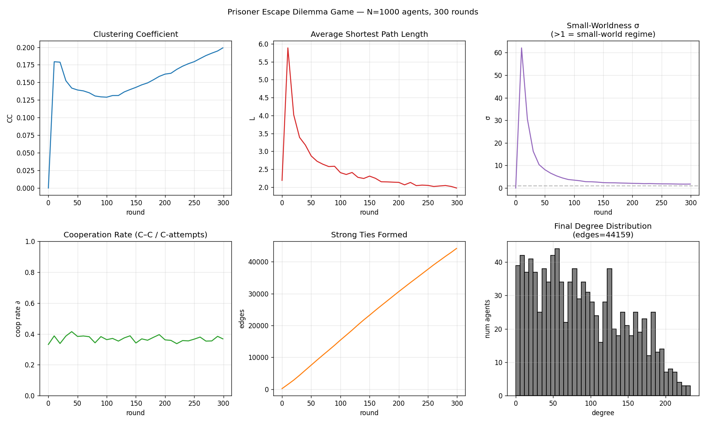

# Prisoner Escape Dilemma Game

This study builds on two classical game models, the **Iterated Prisoner's Dilemma** and the **Expert Game**, and extends them into a framework where both strategies and network structures co-evolve. Through a *Prisoner Escape Dilemma Game*, it aims to simulate how portfolio workers collaborate in the real world: when entering a new network, newcomers hold incomplete information about each other — they cannot directly know other members' reliability or intentions, and instead must rely on referrals, indirect reputational signals, and past interactions to gradually update their priors and decide whether to collaborate.

## The Prisoner Escape Dilemma Game

This game imagines a prison with *N* prisoners. Each prisoner serves a life sentence and is assigned one unique expertise. Expertise assignments are private information. Social encounters occur during yard time, lunch time, and daily task assignments in prison, which create opportunities for interaction.

An agent has just been thrown into the jail as a newcomer. The agent faces a fully unfamiliar network and does not know who can be trusted. From this zero-starting point, the agent must find complementary partners, form temporary teams to complete staged tasks, and advance step by step toward the ultimate goal of escape.

## Strategies and Network Structures Coevolving

Each agent can choose among four actions: **Collaborate (C)**, **Decline (D)**, **Referral (R)**, and **Save for future (S)**. Here, we define *topological distance* as the degree of separation between agents. When an agent takes a certain action, the network will adapt and co-evolve accordingly:

- **Collaborate (C):** When two agents collaborate successfully, they form a strong tie and become first-degree connections (topological distance = 1) regardless of prior distance. For example, when you collaborate with a second-degree referral, that partner immediately becomes your first-degree connection (weak tie → strong tie).
- **Referral (R):** When a new partner is referred by a first-degree connection, that partner enters as a weak tie (topological distance ≥ 2). If collaboration later occurs, the topological distance collapses to 1; if not, the link remains a weak tie.
- **Decline (D):** When an agent refuses or defects from collaboration, no new link is formed. The topological distance stays the same or increases if an existing weak tie is abandoned.
- **Save for future (S):** When an agent defers collaboration, no link is created, but the potential tie remains. If collaboration happens later, the distance can shorten to 1 (topological distance = 1).

## Simulation and Validation

The experiment will be validated through an **inverse generative modeling** approach: we set the moderate small-world topology as the target benchmark, and identify the local rules that best reproduce the pattern.

First, we use an agent-based simulation to run the Prisoner Escape Dilemma Game under different local rule sets. During the process, agents update their trust estimates through Bayesian inference.

To test how strategies and network structures evolve alongside the rule sets, we can monitor and evaluate them by:

- Clustering coefficient (**CC**)
- Average path length (**L**)
- Cooperation rate (**∂**)

…and compare the results with *random matching* and *no referral* baselines.

## Results

